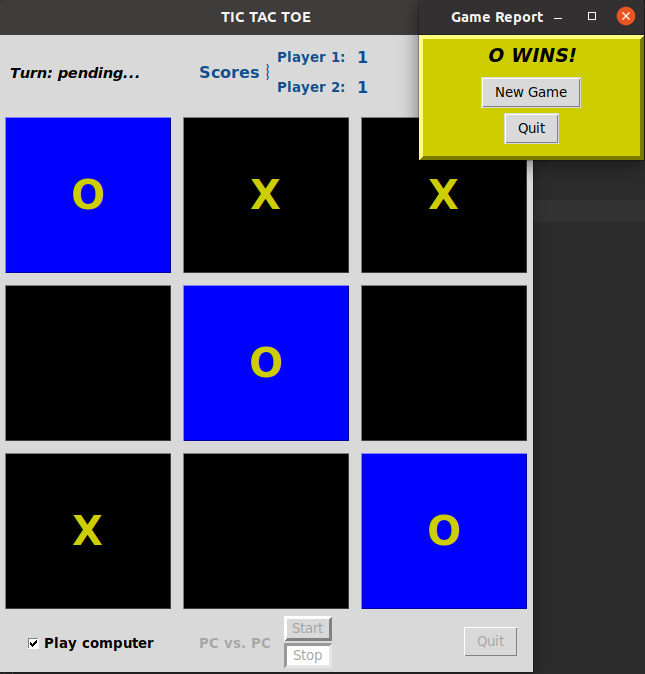
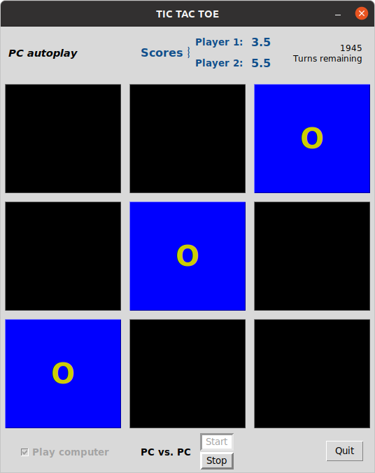

# Project: tic-tac-toe-tkinter

Image modified from https://en.wikipedia.org/wiki/File:Tic_tac_toe.svg

Game design inspired by Riya Tendulkar code:
https://levelup.gitconnected.com/how-to-code-tic-tac-toe-in-python-using-tkinter-e7f9ce510bfb
https://gist.github.com/riya1620/72c2b668ef29da061c44d97a82318572

## A Tic Tak Toe Game in tkinter

Developed with Python 3.8, under Ubuntu 20.04, Windows 10 and macOS 10.13. Should work with Python 3.6.
Recent Python packages can be downloaded from https://www.python.org/downloads/.

### Usage: 
From a command line:
From within the tic-tac-toe-tk-main folder, execute `ttt.py` from a Terminal or Command Prompt:
- Linux/MacOS: `python3 ttt.py` or `./ttt.py`
- Windows: `python3 ttt.py` or `python ttt.py` or `py ttt.py`, depending on your system environment.

### Play action
Start of a game in Player vs. Player mode, waiting for Player 1's first move:

Player 1 won after 5 turns:

Player vs Player, tie game awards a half point to each player:

Player vs. PC mode, PC won second game:

Autoplay mode. Continuous PC v PC play for ~240 games (starting with 2000 total turns),
PC Player 2 (O) just won:

### Development Plans
* Wait for user feedback...
