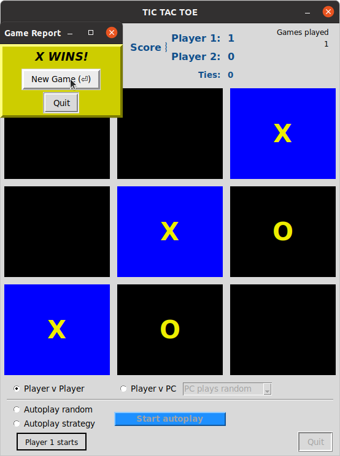

# Project: tic-tac-toe-tkinter

Image modified from https://en.wikipedia.org/wiki/File:Tic_tac_toe.svg

Game design inspired by Riya Tendulkar code:
https://levelup.gitconnected.com/how-to-code-tic-tac-toe-in-python-using-tkinter-e7f9ce510bfb
https://gist.github.com/riya1620/72c2b668ef29da061c44d97a82318572

## A Tic Tak Toe Game in tkinter

Developed with Python 3.8, under Ubuntu 20.04, Windows 10 and macOS 10.13. Should work with Python 3.6.
Recent Python packages can be downloaded from https://www.python.org/downloads/.

### Usage: 
From a command line:
From within the tic-tac-toe-tk-main folder, from a Terminal or Command Prompt, depending on your system environment:

            python3 -m plot_jobs (recommended for all systems)
            py plot_jobs.py (Windows)
            python3 plot_jobs.py (Linux, Mac)
            ./plot_jobs.py (Linux, Mac)

### Play action
There are four play modes:
- Player vs Player
- Player vs PC (computer)
- Autoplay, random (computer plays itself randomly)
- Autoplay, strategy (computer itself with rules)

In Player v PC game mode, you can choose among computer play options:
- PC plays random
- PC plays corners
- PC plays center
- PC plays strategy.

In Autoplay mode, PC plays itself. You can choose to have Player 1 (X) start every game or have both Players alternate game starts. 1000 turns are played at about 3 turns per second. Scores are updated in realtime through the series of about 110 to 130 games. Studying autoplay results in different play modes can be instructive for improving your game strategies!

### Screenshots

Player 1 wins 1st game in Player v Player mode. Ready for Player 1 to start 2nd game with a click (or with Return/Enter). The result window can be repositioned from its default location.

Autoplay random mode with Player 1 starting all games, in progress, with 555 turns remaining:

### Known Issues
Waiting for feedback...
