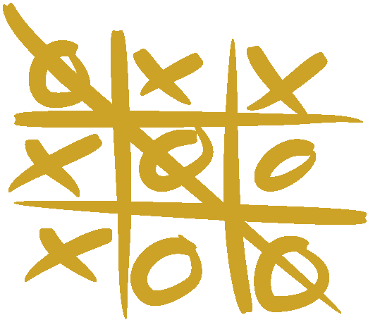
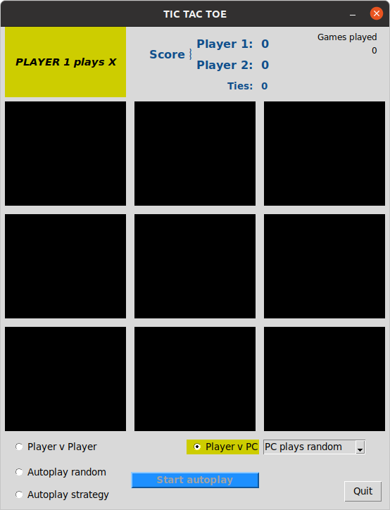
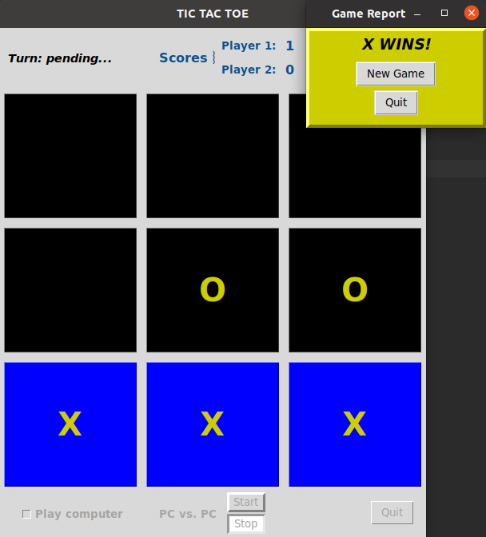
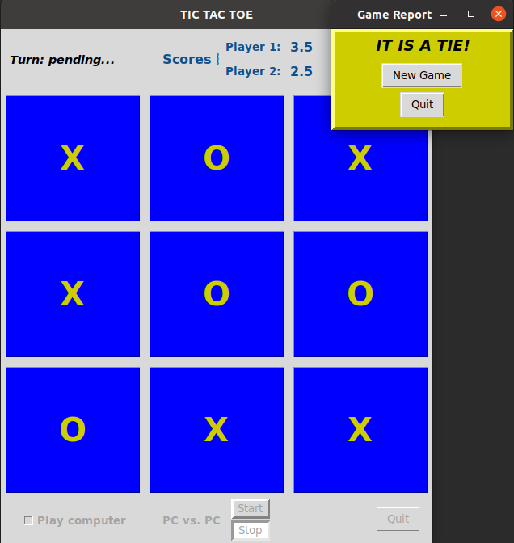
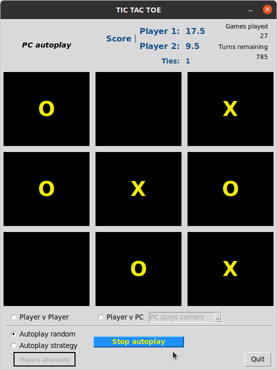

# Project: tic-tac-toe-tkinter
## Last update introduced a bug in PvPC play. Please stand by....

Image modified from https://en.wikipedia.org/wiki/File:Tic_tac_toe.svg

Game design inspired by Riya Tendulkar code:
https://levelup.gitconnected.com/how-to-code-tic-tac-toe-in-python-using-tkinter-e7f9ce510bfb
https://gist.github.com/riya1620/72c2b668ef29da061c44d97a82318572

## A Tic Tak Toe Game in tkinter

Developed with Python 3.8, under Ubuntu 20.04, Windows 10 and macOS 10.13. Should work with Python 3.6.
Recent Python packages can be downloaded from https://www.python.org/downloads/.

### Usage: 
From a command line:
From within the tic-tac-toe-tk-main folder, execute `ttt.py` from a Terminal or Command Prompt:
- Linux/MacOS: `python3 ttt.py` or `./ttt.py`
- Windows: `python3 ttt.py` or `python ttt.py` or `py ttt.py`, depending on your system environment.

### Play action
Start of a game in Player vs. Player mode, waiting for Player 1's first move:

Player 1 won first game:

Player 2 tied the second game; a half point was awarded to each player:

Autoplay, strategy mode, in progress:

In Autoplay mode (computer vs computer), 1000 turns are played. Scores are updated in realtime through the series of about 120 to 140 games.

In Player v PC game mode, you can choose to have computer play with different preferences.

### Known Issues
Waiting for feedback...