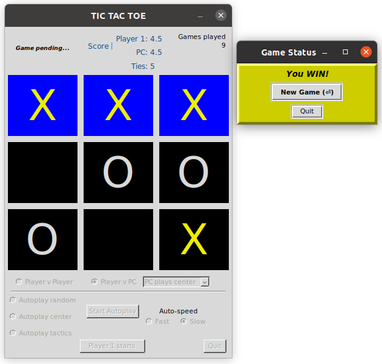

# Project: tic-tac-toe-tkinter

Image modified from https://en.wikipedia.org/wiki/File:Tic_tac_toe.svg

Game design inspired by Riya Tendulkar code:
https://levelup.gitconnected.com/how-to-code-tic-tac-toe-in-python-using-tkinter-e7f9ce510bfb
https://gist.github.com/riya1620/72c2b668ef29da061c44d97a82318572

## A Tic Tak Toe Game in tkinter

Developed with Python 3.8, under Ubuntu 20.04, Windows 10 and macOS 10.13. Should work with Python 3.6.
Recent Python packages can be downloaded from https://www.python.org/downloads/.

### Usage: 
From a command line:
Open the Terminal or Command Prompt from within the tic-tac-toe-tk-master folder and enter one of these command lines, depending on which is appropriate for your system:

            python3 -m plot_jobs (recommended for all systems)
            py plot_jobs.py (Windows)
            python3 plot_jobs.py (Linux, Mac)
            ./plot_jobs.py (Linux, Mac)

### Play action
There are five play modes:
- Player vs Player
- Player vs PC (computer)
- Autoplay, random: Computer plays itself randomly; about 15% end in ties.
- Autoplay, center: Prefers the center, then plays for win, then block, then random; ~60% tie games.
- Autoplay, tactics: A game of defensive and offensive moves, with minimal use of random play. The priority of PC play is win, block, defend against opponent advantage, play a corner for advantage, play random; ~98% tie games.

In Player v PC game mode, the human Player can choose among options for the PC to play, as described above for the corresponding autoplay modes.
- PC plays random; easiest to beat
- PC plays center
- PC plays tactics; hardest to beat

Wins, ties, and mode-specific PC moves are recorded in the Terminal window when "center" or "tactics" PC modes are selected. This output may help the human improve their game. Good luck!

In Autoplay mode, the PC plays itself. You can choose to have Player 1 (X) start every game or have the PC Players 1 & 2 alternate game starts. 1000 turns are played. Fast mode is at a rate of about 10 turns per second, slow is one turn per second. Scores are updated in realtime through the turn series, giving about 110 to 130 games. Studying autoplay results in different play modes can be instructive for improving your game strategies!

### Screenshots

Human (Player 1, X) wins 9th game in "PC plays center" mode. A Game Status pop-up window prompts user to play again or quit the program. The pop-up window can be repositioned.

Autoplay game in progress with tactics mode, with PC players alternating start turns, 745 turns remaining, autoplay speed set to Slow, the default:

### Keyboard navigation

All actions done with the mouse can also be done with keys. To place marks in squares, use either the numeric keypad or the nine letter keys on the left side of the keyboard. In both cases, the top row of keys corresponds to the top row of squares, followed by middle and bottom rows.

When two people are competing in Player v Player mode, one can use the mouse while the other uses the keyboard.

Modes and buttons can be selected by cycling focus through them with the Tab key. The direction of the cycle is reversed with Shift-Tab. A mode or option that has focus is activated by pressing Enter or the space bar. The 'Player 1 starts' button in the lower left becomes selectable only when an Autoplay mode is active; toggle between 'Player 1 starts' and 'Players alternate' with the space bar.

The space bar similarly activates the Quit button once it has selection focus.

### Known Issues
Waiting for feedback...
